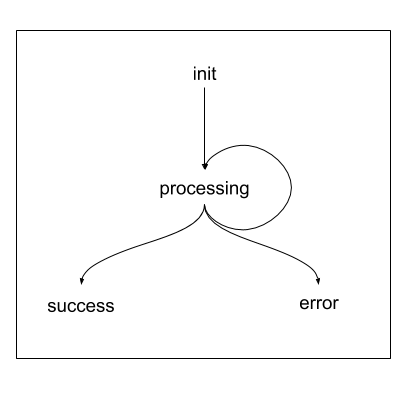

# Vodafone coding challenge

After reading the brief I decided what was required was a simple state machine to reliably transition between states and provide the transition functions to be called when state is changed. 

In practice I think my solution is over engineered (depending on the complexity of the chains and considerations about concurrency etc) and I could have met the requirements with a more simplistic approach and knocked it out in less than half an hour. However as a technical test this approach allowed me to demonstrate how I would abstract the concerns of a real problem and follow a TDD workflow through a more complicated solution.

I hope its what was expected, I regret not using ES6 class syntax - I took the lead from the function stub provided and had finished the problem before realising this was probably a better idea.

All in, I spent around an hour and 20 minutes broken down as; 
- 20 minutes to skeleton the files, setup the repo and skeleton the failing tests
- 20 minutes sketching out the state machine and adding the ability to call the function with a JSON file
- 30 minutes fleshing out unit tests and debugging
- 10 minutes tidying up the docs and presentation

With some more time I would:
- Add some further failing tests to ensure there is no false positives and that the code is erroring appropriately.
- Bundle the package into a CJS module using rollup and distribute as a installable CLI and/or via NPM

## Running the code
I am using mocha to run the unit tests and to present the proof that the helper meets requirements.

### Install
After cloning the git repository run:

`npm install`

### Run
To run the proofs use:

`npm run proof`

And to pass a JSON to the function use:

`node index.js ./sampleData.json`

### Test
The full suite of unit tests can be run with:

`npm test`

## Assumptions
1) That state = "error" cannot preceed the state = "processing"
2) That state = "success" cannot preceed the state = "processing"
3) That multiple processing states can be chained
4) That multiple processing states can be run concurrently
4) That the chain of states will always complete with state = "error" or state="success" but never with both
5) That if state=="success" then errorCode will be either "not defined", "undefined" or "null"
6) That state must be "processing" at least once in the chain

## State Diagram
